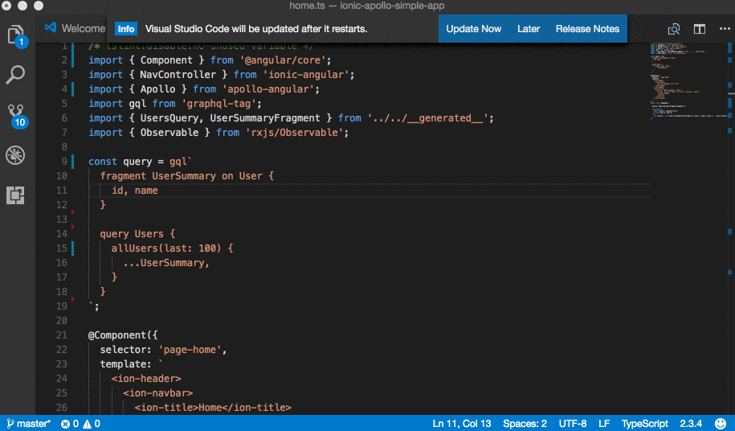
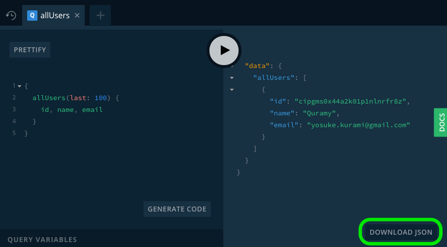
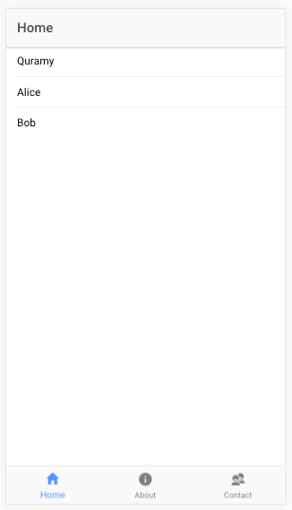

# Ionic Apollo Simple App
Explains how to develop Ionic app with Apollo.

## Run app at your local machine

Clone this repository and exec :

```sh
cd ionic-apollo-simple-app
npm -g install ionic@latest
npm install // # or yarn
ionic serve
```

## Development Guide
From this point I explain how to integrate GraphQL into Ionic project step by step.

### Scaffold Ionic App
You can create the new Ionic app project via

```sh
npm install -g ionic@latest
ionic start
```

### GraphQL Server Side
[GraphQL](http://graphql.org/) is a query language for API developed by Facebook.

This app uses [graph.qool](https://console.graph.cool) as GraphQL server.

This server defines one simple model `User`, which is extended a graph.cool's built-in model. For example, the following GraphQL query:

```graphql
{
  allUsers(last: 100) {
    id, name
  }
}
```

returns data such as:

```json
{
  "data": {
    "allUsers": [
      {
        "id": "cipgms0x44a2k01p1nlnrfr8z",
        "name": "Quramy"
      }
    ]
  }
}
```

*Try query explorer [here](https://api.graph.cool/simple/v1/cipglmpu146dt01mzwqctkbwd?query=%7B%0A%20%20allUsers(last%3A%20100)%20%7B%0A%20%20%20%20id%2C%20name%2C%20email%0A%20%20%7D%0A%7D).*


### GraphQL Client Dev tools
Before development your app, I introduce two utility libraries for GraphQL client-side development.

- [ts-graphql-plugin](https://github.com/Quramy/ts-graphql-plugin) displays auto completion and syntax & semantics errors for GraphQL query in your .ts source codes.  

- [apollo-codegen](https://github.com/apollographql/apollo-codegen) generates TypeScript type annotations from GraphQL query in your source codes.

To install them via exec:

```sh
npm install -S graphql-tag
npm install -D apollo-codegen ts-graphql-plugin
```

And edit `tsconfig.json` and `package.json`.

```js
/* tsconfig.json */

 "compilerOptions": {
    // ...
    "plugins": [
      {
        "name": "ts-graphql-plugin",
        "schema": "schema.json",
        "tag": "gql"
      }
    ]
```

```js
/* tsconfig.json */

  "scripts": {
    // ...
    "gen": "apollo-codegen generate --target ts --output src/__generated__.ts \"src/**/*.ts\""
  },
```

Finally, download GraphQL Schema JSON file from [graph.cool prayground](https://api.graph.cool/simple/v1/cipglmpu146dt01mzwqctkbwd?query=%7B%0A%20%20allUsers(last%3A%20100)%20%7B%0A%20%20%20%20id%2C%20name%2C%20email%0A%20%20%7D%0A%7D) and save it as `schema.json` under the project.
;

Ok, it's ready to go! Open `src/pages/home/home.ts` in your editor or IDE.

```ts
import { Component } from '@angular/core';
import { NavController } from 'ionic-angular';

// Append the following
import gql from 'graphql-tag';

const query = gql`
  fragment UserSummary on User {
    id, name
  }

  query Users {
    allUsers(last: 100) {
      ...UserSummary,
    }
  }
`;

@Component({
// ...
```

And save `hoge.ts` then, exec `npm run gen` script. After successfully running open `src/__generated__.ts`, you can get the following generated type annotation:

```ts
export type UsersQuery = {
  allUsers:  Array< {
    id: string,
    name: string | null,
  } >,
};

export type UserSummaryFragment = {
  id: string,
  name: string | null,
};
```

The above types allow us to treat GraphQL queries strictly typed.

### GarphQL Client Side

You should add a GraphQL client library into your project. This app uses [http://dev.apollodata.com/angular2/] as a GraphQL client.

```sh
npm install -S apollo-client apollo-angular
```

#### Network Interface

First, set up GraphQL api connection into this app.

Open `src/app.module.ts` and append the following snippet.

```ts
/* app.module.ts */
import { ApolloClient, createNetworkInterface } from 'apollo-client';
import { ApolloModule } from 'apollo-angular';

export const client = new ApolloClient({
  // networkInterface: createNetworkInterface('https://api.graph.cool/simple/v1/cipglmpu146dt01mzwqctkbwd'),
  networkInterface: createNetworkInterface('https://your-graph.cool-endpoint'),
});

export function provideClient(): ApolloClient {
  return client;
}
```

The `provideClient` function is called Angular DI as provider of `ApolloClient`. `ApolloModule.forRoot()` creates a new Angular module and bind `ApolloClient` provider.

```ts
@NgModule({
  // ...
  imports: [
    BrowserModule,
    IonicModule.forRoot(MyApp),
    ApolloModule.forRoot(provideClient), // <- Append this line
  ],
  // ...
})
```

#### Execute Query
We're ready to execute GraphQL query using ApolloClient provided by Angular DI. Open `src/pages/home/home.ts` and add a dependent service as an argument of constructor.

```ts
import gql from 'graphql-tag';
import { Apollo } from 'apollo-angular';  // Apollo client service
import { UsersQuery, UserSummaryFragment } from '../../__generated__'; // <- Import generated types by `npm run gen`
import { Observable } from 'rxjs/Observable';

const query = gql`
# ...
`;

export class HomePage {
  constructor(
    public navCtrl: NavController,
    private apollo: Apollo, // <- Add apollo client as an Angular service
  ) { }
}
```

A private member field `apollo` is used as a GraphQL API client. Use this service like the following:

```ts
const query = gql`
  fragment UserSummary on User {
    id, name
  }

  query Users {
    allUsers(last: 100) {
      ...UserSummary,
    }
  }
`;

export class HomePage {
  users$: Observable<UserSummaryFragment[]>;

  constructor(
    public navCtrl: NavController,
    private apollo: Apollo,
  ) {
    this.users$ = this.apollo.query<UsersQuery>({ query })
      .map(({ data }) => data.allUsers);
  }
}
```

The `Users` GraphQL query is executed by `this.apollo.query<UsersQuery>({ query })`. As described above, this query results a JSON data such as:

```json
{
  "data": {
    "allUsers": [
      { "id": "u001", "name": "Alice" },
      { "id": "u002", "name": "Bob" }
    ]
  }
}
```

And apollo-codegen tells us that the type of the result of this query is `UsersQuery`. `Apollo` service returns result  as a RxJS `Observable` object. So using rxjs operators (e.g. `map` or `pluck` or etc...), we can convert the apollo result to `Observable<UserSummrayFragment[]>`.

#### Display Query Result
Using `async` pipe in your template, Anguar automatically subscribe(and also unsubscribe) the apollo stream.

```html
<ion-header>
  <ion-navbar>
    <ion-title>Home</ion-title>
  </ion-navbar>
</ion-header>
<ion-content>
  <ion-list>
    <button ion-item *ngFor="let user of users$ | async">
      {{user.name}}
    </button>
  </ion-list>
</ion-content>
```

### Run your app
That's all, start app via `ionic serve`!



